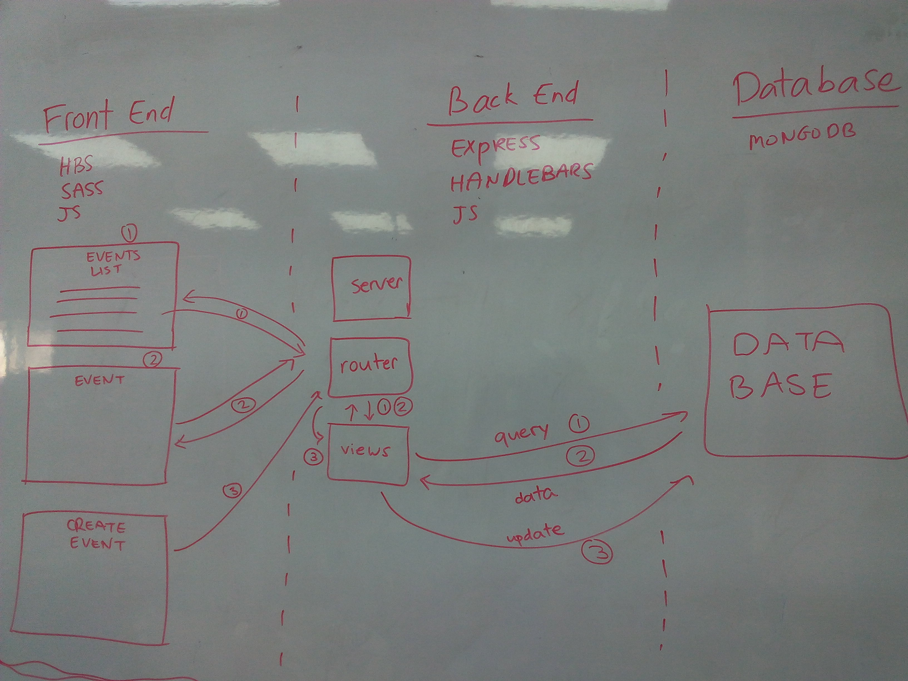

# Something Good
## An App for Volunteering Events

##### App Link: https://somethingood.herokuapp.com/

### Goals

* Give volunteers information about volunteering events
* Create a platform where volunteers and organizations can post their volunteering events

### User Journey
**As a volunteer, I want to go to the app, get information, and create volunteering events**

### App Flow

The user opens the home page, and sees the logo and description of the app. The user can click the logo to get to the Events Page.

The Events Page shows the upcoming volunteering events, ordered by date.

The user can click on each event to see more details about it, including a map for exact location.

The user can click on a button to indicate his/her intention to participate in the event.

The user can create an event using a form, which will be added to the Events Page.

### Technologies

After we searched about the features that every Technology provides we chose to work with Express + Handlebars + MongoDB + SASS.
##### Why?
1. **Express** is a minimal and flexible Node.js web application framework that provides a robust set of features to develop the web and mobile applications. It facilitates the rapid development of Node based web applications. These are some of the core features of Express framework −

 * Allows to set up middlewares to respond to HTTP Requests.

 * Defines a routing table which is used to perform different actions based on HTTP Method and URL.

 * Allows to dynamically render HTML Pages based on passing arguments to templates.

2. **MongoDB** is a database. This is the place where we want to store the information for our application.

3. **SASS** makes CSS fun again. Sass is an extension of CSS, adding nested rules, variables, mixins, selector inheritance, and more. It's translated to well-formatted, standard CSS using the command line tool or a web-framework plugin.

4. **Handlebars** adds a couple of additional features to make writing templates easier and also changes a tiny detail of how partials work.

### Team Guidelines

* CamelCase for JavaScript id's
* kebab-case for SASS classes
* comments for code clarification
* ES6 on backend
* other team member understands the code before approval

### Architecture

### Wireframe

### Stretch Goals

* user sign-up and login
* vote for events
* show past events
* add coin system for earning coins when participating in events
